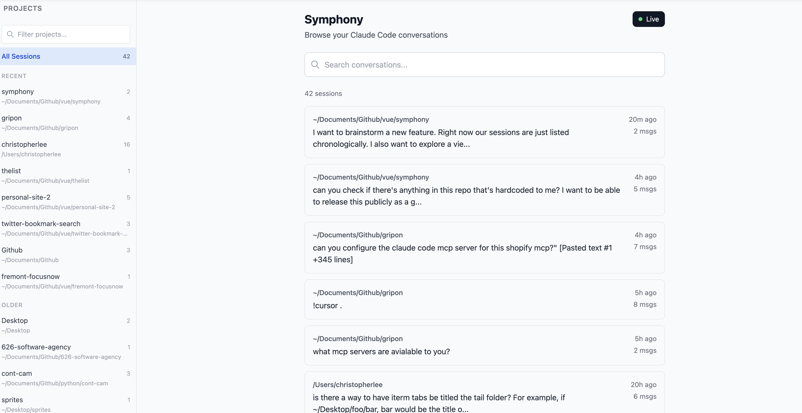
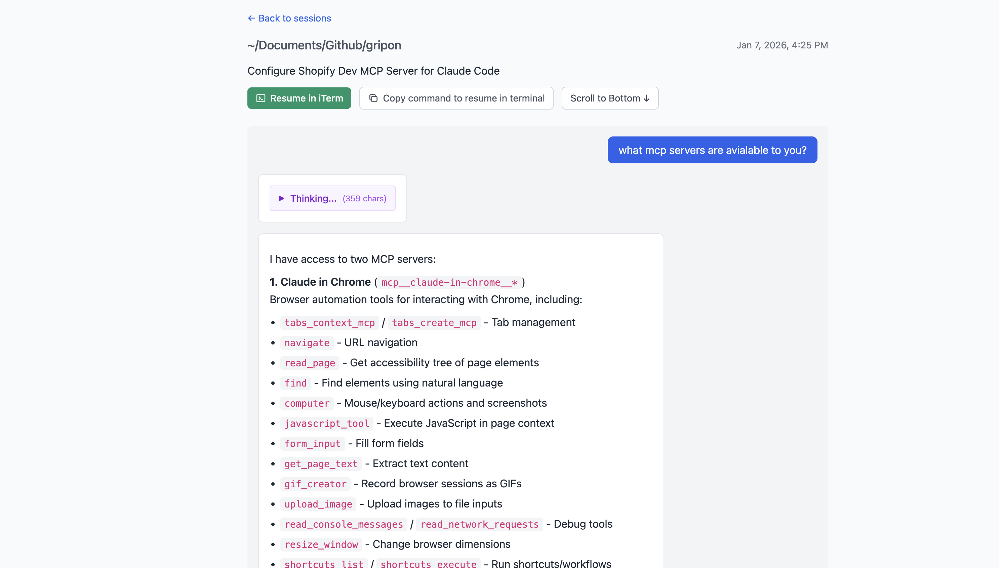

**Disclaimer: this project is 100% vibe-coded**

# Symphony

A web-based browser living in localhost for your Claude Code conversation history. View, search, and explore past sessions.





## Features

- Browse all Claude Code sessions sorted by recency or by project
- Full-text search across conversations
- Live view of ongoing sessions
- Resume any session in iTerm with one click, or copy the CLI command
- Markdown rendering with support for thinking blocks, tool calls, and context compaction

## Requirements & Assumptions

- **macOS** - Uses AppleScript for terminal integration
- **iTerm** - Terminal opening functionality assumes iTerm

## Quick Start

```bash
npm install
npm run dev
```

Then open http://localhost:3000
